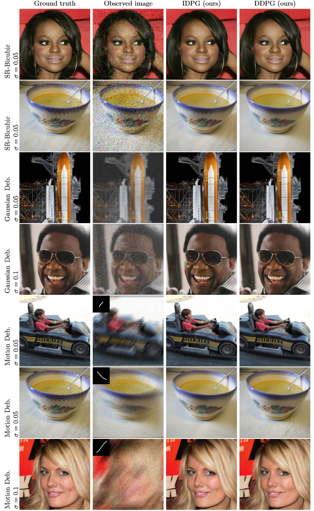

# Image Restoration by Denoising Diffusion Models with Iteratively Preconditioned Guidance

## 📖[**Paper**](https://arxiv.org/pdf/2312.16519.pdf) (CVPR 2024)

[Tomer Garber](https://scholar.google.com/citations?user=-ZciND8AAAAJ), [Tom Tirer](https://scholar.google.com/citations?user=_6bZV20AAAAJ)

The Open University of Israel and Bar-Ilan University

# Introduction

This repository contains the code release for *Image Restoration by Denoising Diffusion Models with Iteratively
Preconditioned Guidance* (***DDPG***).

Main idea: identifying [back-projection](https://arxiv.org/abs/1710.06647) (BP) guidance (used recently under the names "pseudoinverse" or "range/null-space" guidance) as a preconditioned version of least squares (LS) guidance, and accordingly, devising a guidance technique with iteration-dependent preconditioning that traverses from BP to LS, enjoying the benefits of both.

## Supported degradations

1. Super-Resolution (Bicubic)
2. Gaussian Deblurring
3. Motion Deblurring

The code can be very easily adapted to super-resolution and deblurring with any kernel.  
Extension to other linear measurement models is also possible.

# Setup

## Installation

### Clone this repository

To clone this repository and the code, run:

```bash
git clone https://github.com/tirer-lab/DDPG.git
```

### Environment

There are several dependencies required, and you may install it via *pip* or *docker*.
The code was written and tested on Python 3.8 and PyTorch 1.9.0.

#### Pip

```
pip install torch torchvision lpips numpy tqdm pillow pyYaml pandas scipy
```

Install the relevant torch and torchvision versions according to your setup, for example:

```
pip install torch==1.9.0+cu111 torchvision==0.10.1+cu111 -f https://download.pytorch.org/whl/torch_stable.html
```

#### Docker

The repository contains [Dockerfile](Dockerfile), in order to use it run (after cloning this repo and `cd` to it):

```bash
docker build .
```

If you wish to run *IDPG* instead of *DDPG*, You can swap the [`CMD`](Dockerfile#L11) commands in the Docker file.

## Pre-Trained Models

To download the models used in the paper:

### CelebA-HQ

The CelebA-HQ model checkpoint can be
found [here](https://drive.google.com/file/d/1wSoA5fm_d6JBZk4RZ1SzWLMgev4WqH21/view?usp=share_link).
Download it and place it in `DDPG/exp/logs/celeba/`.

### ImageNet
The ImageNet model checkpoint can be
found [here](https://openaipublic.blob.core.windows.net/diffusion/jul-2021/256x256_diffusion_uncond.pt).
Download it and place it in `DDPG/exp/logs/imagenet/`.

## Quick Start
Run the following commands to get immediate DDPG results:

1. CelebA noiseless SRx4:
    ```bash
    python main.py --config celeba_hq.yml --path_y celeba_hq --deg sr_bicubic --sigma_y 0 \
    -i DDPG_celeba_sr_bicubic_sigma_y_0 --inject_noise 1 --zeta 0.7 --step_size_mode 0 \
    --deg_scale 4 --operator_imp SVD
    ```

2. CelebA Gaussian deblurring with sigma_y=0.05:
    ```bash
    python main.py --config celeba_hq.yml --path_y celeba_hq --deg deblur_gauss --sigma_y 0.05 \
    -i DDPG_celeba_deblur_gauss_sigma_y_0.05 --inject_noise 1 --gamma 8 --zeta 0.5 --eta_tilde 0.7 \
    --step_size_mode 1 --operator_imp FFT
    ```

The results will be in `DDPG/exp/image_samples/`.
## Full Datasets

The datasets used in the paper are CelebA-HQ and ImageNet. Both can be found in: 
[[Google drive](https://drive.google.com/drive/folders/1cSCTaBtnL7OIKXT4SVME88Vtk4uDd_u4?usp=sharing)] [[Baidu drive](https://pan.baidu.com/s/1tQaWBqIhE671v3rrB-Z2mQ?pwd=twq0)].

After you download the datasets, place each dataset in the relevant directory:

1. CelebA-HQ - Place the dataset in `DDPG/exp/datasets/celeba/`.
2. ImageNet -  Place the dataset in `DDPG/exp/datasets/imagenet/`.
   1. Download the file `imagenet_val_1k.txt` from the links above as well, and place it in `DDPG/exp`. Rename this file to `imagenet_val.txt` in order for the code to use it.

## Motion Deblur

For motion deblur we used the following git repository to generate the
kernels: https://github.com/LeviBorodenko/motionblur.

Clone that repository and copy the *motionblur.py* file into `DDPG/functions`.

As mentioned in the paper, we used motion deblur kernels with `intensity=0.5`.

## Parameters

The general python command to run the code is:
```
python main.py --config {config}.yml --path_y {dataset_folder} --deg {deg} --sigma_y {sigma_y}
-i {image_folder} --inject_noise {inject_noise} --gamma {gamma} --zeta {zeta} --eta_tilde {eta_tilde}
--step_size_mode {step_size_mode} --operator_imp {operator_implementation} --save_y {save_observation}
--scale_ls {scale_for_gLS}
```

Where:

- `config`: The name of the yml to use to configure the model used.
- `dataset_folder`: The name of the directory containing the image dataset.
- `deg`: the degradation type to use. Used in paper: `sr_bicubic`, `deblur_gauss`, `motion_deblur`
    - When using `sr_bicubic`, the flag `--deg_scale 4` is also required
- `sigma_y`: Noise level. Noise levels used in paper: `0, 0.01, 0.05, 0.1`.
- `image_folder`: Name of directory for output images.
- `inject_noise`: Whether to inject noise (1) and run *DDPG* or not (0) and run *IDPG*.
- `gamma`: The Gamma hyperparameter used in the paper.
- `zeta`: The Zeta hyperparameter used in the paper.
- `eta_tilde`: The Eta hyperparameter used in the paper.
- `step_size_mode`: Which step size mode to use. In the paper, `step_size_mode=0` (fixed 1) was used for IDPG, noiseless DDPG and 
DDPG with noise level `0.01`. `step_size_mode=1` (certain decay) was used for the rest of the DDPG runs.
- `operator_implementation` - Whether to use `SVD` or `FFT`. Defaults to `FFT`.
- `scale_ls` - The `c` hyperparameter used in the paper, which is Least Squares guidance scale. Defaults to `1`. 
- `save_observation` - Whether to save the observed image (`y`) or not. Defaults to `False`.


Additionally, you can configure the sampling steps (defaults to `100` in the paper). In each yml config under `configs` directory
(`celeba_hq.yml`, `imagenet_256.yml` and `imagenet_256_cc.yml`) you may change:
```yaml
sampling:
  T_sampling: <desired_sampling_steps>
```

## Evaluation

In order to reproduce the paper's results, there are 2 evaluation scripts:

1. [evaluation_DDPG.sh](evaluation_DDPG.sh) for *DDPG* results.
2. [evaluation_IDPG.sh](evaluation_IDPG.sh) for *IDPG* results.

Both scripts contain all tasks mentioned in the paper with the relevant configuration.

## Qualitative Results



Additional results can be found in the paper, including PSNR and LPIPS results compared to competitors.

## Citations
If you used this repository in your research, please cite the paper:
```
@inproceedings{garber2023image,
  title={Image Restoration by Denoising Diffusion Models with Iteratively Preconditioned Guidance},
  author={Garber, Tomer and Tirer, Tom},
  booktitle={Proceedings of the IEEE/CVF conference on computer vision and pattern recognition},
  year={2024}
}
```

This implementation is inspired by https://github.com/bahjat-kawar/ddrm and https://github.com/wyhuai/DDNM.
